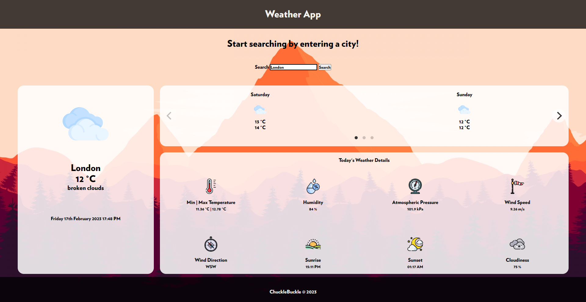

# FireWatch Themed Weather App
- uses Firewatch font
- Draggable, smooth carousel slider using Flickity
- responsive website

[Try it live here!](https://chucklebuckle11.github.io/weather-app/)

## How to use
1. Type in a valid city within the search bar.
2. Hit Enter, or click on the Search button.
3. The page should now load with the relevant weather information for that city!

## Limitations
- Temperature data for the weather forecasts are exact 24-hour differences and do not represent temperature across an entire day

